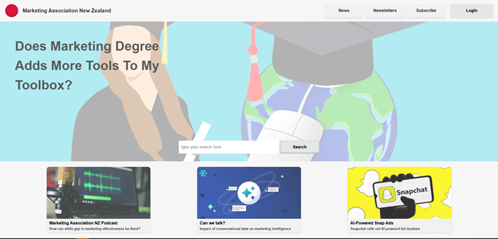

<a id="readme-top"></a>

# Marketing Association New Zealand News Website

A responsive news website that adapts to different screen sizes using modern web development practices.

## 📑 Table of Contents

1. [About the Project](#about-the-project)
   - [Built With](#built-with)
2. [Getting Started](#getting-started)
   - [Prerequisites](#prerequisites)
   - [Installation](#installation)
3. [Usage](#usage)
4. [Roadmap](#roadmap)
5. [Contributing](#contributing)
6. [License](#license)
7. [Contact](#contact)
8. [Acknowledgments](#acknowledgments)

---

<h2 id="about-the-project">🧾 About the Project</h2>

This project is a responsive front-end website designed for the Marketing Association New Zealand. It supports mobile, tablet, and desktop views using CSS media queries and a mobile-friendly hamburger menu.




<p align="left">(<a href="#readme-top">back to top</a>)</p>

<h3 id="built-with">🔧 Built With</h3>

- [](https://reactjs.org/)
- CSS Modules
- JavaScript (ES6+)
- HTML5

---

<p align="left">(<a href="#readme-top">back to top</a>)</p>

<h2 id="getting-started">🚀 Getting Started</h2>

To get a local copy up and running, follow the steps below.

<p align="left">(<a href="#readme-top">back to top</a>)</p>

<h3 id="prerequisites">Prerequisites</h3>

You’ll need [Node.js](https://nodejs.org/) and npm installed on your machine:

```bash
npm install npm@latest -g
```

<p align="left">(<a href="#readme-top">back to top</a>)</p>

<h3 id="installation">🛠️ Installation</h3>

1. Clone the repo

```sh
   git clone https://github.com/smesi36/Mission-0.git
```

2. Install NPM packages

```sh
   npm install
```

3. Change the Git remote URL to avoid accidental pushes to the base repo:

```sh
git remote set-url origin github_username/repo_name
git remote -v  # confirm the changes
```
<p align="left">(<a href="#readme-top">back to top</a>)</p>

<h2 id="usage">💻 Usage</h2>

Once installed, start the development server:

```sh
npm run dev
```
Open your browser and visit http://localhost:5173 to view the site.

<p align="left">(<a href="#readme-top">back to top</a>)</p>

<h2 id="roadmap">🗺️ Roadmap</h2>

- [x] Responsive layout for mobile, tablet, and desktop
- [x] Hamburger menu for smaller screens
- [x] Modular component structure
- [ ] Add routing and navigation functionality
- [ ] Deploy to GitHub Pages or Netlify
- [ ] Add unit tests for components

<p align="left">(<a href="#readme-top">back to top</a>)</p>

<h2 id="contributing">🤝 Contributing</h2>

Contributions make the open-source community such an amazing place to learn and grow!  
If you have suggestions that would improve this project, feel free to fork the repo and create a pull request.

Steps to contribute:
1. Fork the Project
2. Create a Feature Branch (`git checkout -b feature/YourFeature`)
3. Commit Your Changes (`git commit -m 'Add YourFeature'`)
4. Push to the Branch (`git push origin feature/YourFeature`)
5. Open a Pull Request

<p align="left">(<a href="#readme-top">back to top</a>)</p>

<h2 id="license">📄 License</h2>

Distributed under the MIT License.  
See `LICENSE` file for more information.

<p align="left">(<a href="#readme-top">back to top</a>)</p>

<h2 id="contact">📬 Contact</h2>

**Erekle Sesiashvili**  
📧 [erekles@missionreadyhq.com](mailto:erekles@missionreadyhq.com)  
🔗 [GitHub Repository](https://github.com/smesi36/Mission-0)

<p align="left">(<a href="#readme-top">back to top</a>)</p>

<h2 id="acknowledgments">🙏 Acknowledgments</h2>

- [W3Schools HTML Color Picker](https://www.w3schools.com/colors/colors_picker.asp)
- [Treehouse – Build a Hamburger Menu](https://teamtreehouse.com)
- [CSS Scan – Box-shadow Generator](https://getcssscan.com/css-box-shadow-examples)
- [W3Schools – CSS Flexbox Guide](https://www.w3schools.com/css/css3_flexbox.asp)

<p align="left">(<a href="#readme-top">back to top</a>)</p>